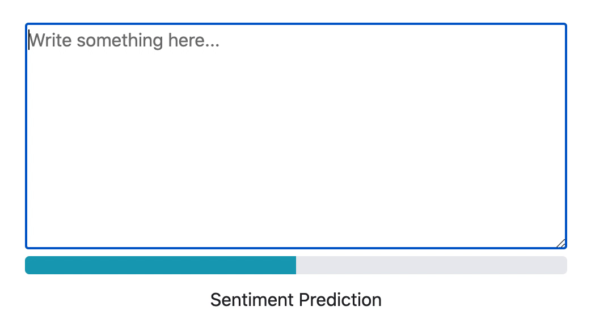

# Sentiment Analysis App

<p align="center"></p>

## Overview

This is an NLP machine learning system which can measure the positive/negative sentiment of user provided text. The machine learning model (built with `Keras`, `TensorFlow`, `scikit-learn`, and `NLTK`) is deployable as a Python package and is placed behind an API written in `Flask`. I've built a simple front end using `Dash` to demonstrate the behavior of the model (shown above). I use `Docker` containers to isolate the API and Front End applications and use `Docker Compose` to deploy the whole system. The model in the back end is currently a bidirectional LSTM.

## Data Sources

I trained the model on a dataset of ~1.6 million labelled tweets, so everything it knows about language sentiment it learned from Twitter! The dataset is called the Sentiment140 dataset and can be downloaded from [here](https://www.kaggle.com/kazanova/sentiment140) or [here](http://help.sentiment140.com/). I also used pre-trained GLoVe word embeddings which can be downloaded from [here](https://nlp.stanford.edu/projects/glove/).

## How to Build and Run

1. I used Gemfury as a private package index. Setup an account and obtain a full access token for the account.

2. Create a `.env` file in the top directory of this repo with the following contents:
```
FURY_USERNAME=
FURY_TOKEN=
API_MODEL_LSTM_VERSION=
```
`API_MODEL_LSTM_VERSION` is the model version you want the API container to fetch from Gemfury and install for use in the application.

3. Train, test and publish the NLP model following the steps in the [model_lstm README](./model_lstm/README.md)

4. Test the API following the steps in the [api README](./api/README.md)

5. Build the whole system with docker-compose:

`$ docker-compose up --build`

6. Bring up `http://localhost:80` in a browser and have a play!

## Next Steps
I'd like to:
- Add a back end database to store user provided sentiment examples
- Add more models (got my eye on those shiny new Transformers)
- Incorporate CI/CD into the workflow
- Add metric monitoring with Prometheus
- Add log monitoring with the Elastic Stack
